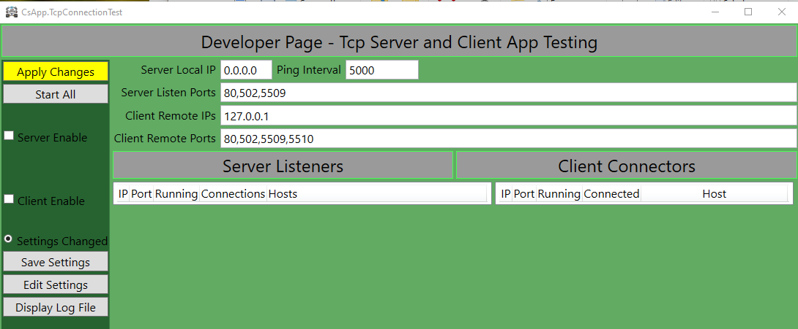
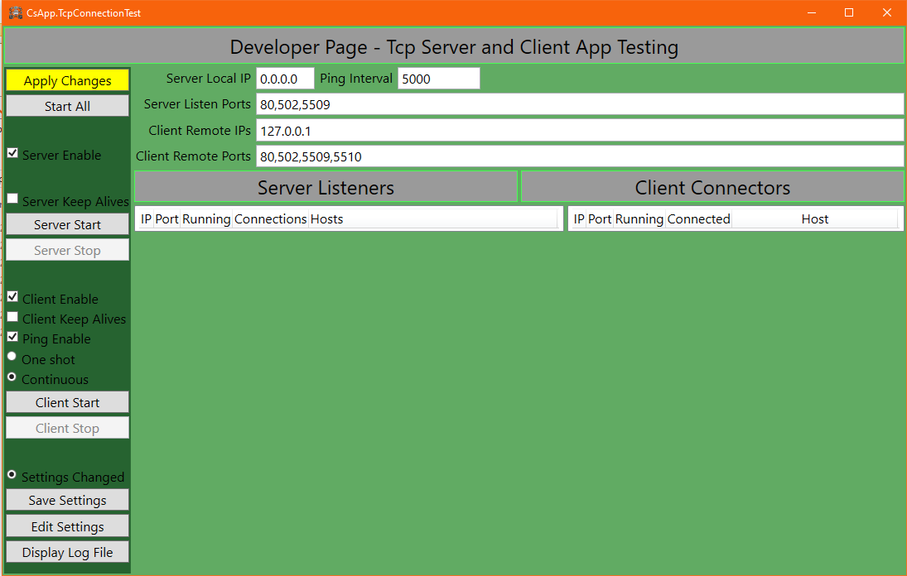
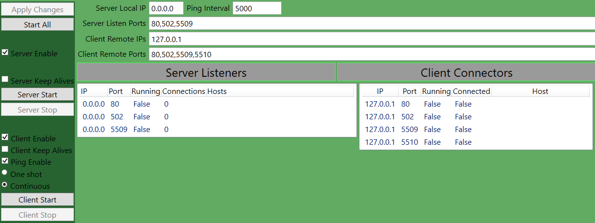
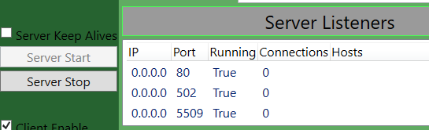
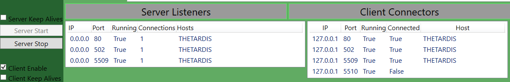
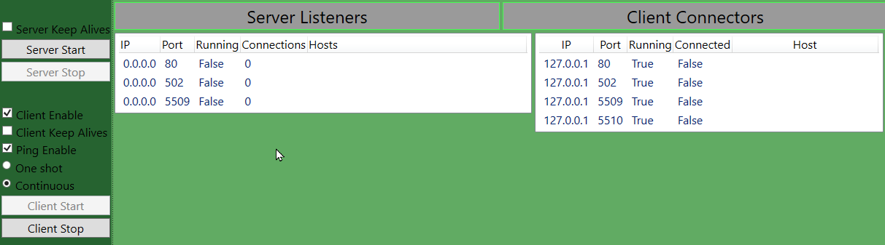
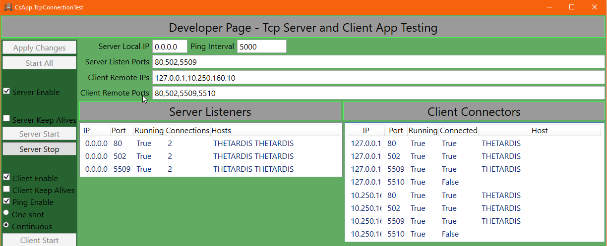

# CsApp.TcpConnectionTest
A simple WPF application using SuperSimpleTcp to test network connectivity and simulate TCP services.
This package contains the executables and installer only.

## Installation

* Download the zip file from GitHub https://github.com/cshawky/CsApp.TcpConnectionTest
* Unzip the file to a temporary folder say C:\Source
* Open the folder and read the readme
* Run Install.cmd with elevated priveleges.

The application will be installed to C:\Program Files\CShawky\{AppName} but may be manually deploy it anywhere your computer security settings allow. 
The idea is that the user has read only rights to the executable folder.

The best way to use the app, is to create a desktop shortcut(s) and a folder for each shortcut start up folder location. Modify the shortcut and use the folder as the start up location.
All logs and settings will be saved to this location. That way you may store multiple sets of configuration. The application has its own defaults
found in the program files folder.

This release is time limited.

The user interface provides full configuration and diagnostics of the app.

## Operation

Multiple instances of the app may run, but only if the working directory is different. Setup shortcuts as described above.
The intention is for the programme to act as a server or a client, not necessarily both, but both are permitted. The two
components operate independently.

The server (if enabled) will create a listen port and bind to the local IP. The default is 0.0.0.0 or 127.0.0.1. If you wish
to bind to a specific interface, the programme will need to run with elevated permissions. Please refer to SuperSimpleTcp for notes.

Once configured, the "Apply Changes" button creates the services accordingly. If you make other changes they do not get applied
until the servers and clients are stopped and changes applied. You may independently save changes to the settings file.

Window position is saved to registry.

Settings are saved to an xml file in the current working directory or appdata.

The default settings found in the application folder dictate what properties are set on first run. After that properties from
the application folder and user folder are merged.

The client sends the computer name on connect then a text Ping message periodically when Continuous mode is active. The server responds with Pong. This data transfer helps detect connection failure. The Ping/Pong data transfer seems to work really well in having the server and client detect inactivity and disconnection.

Tcp Keep Alives may or may not be helpful. The operating system initiates keep alives, so the application itself has no visibility of this. One assumes that the keep alives may assist with network disconnection detection.

## Testing
To test the application, the same set of ports were configured for server and client. The server and client are started.
One observes the clients disconnecting if the servers are stopped. One observes some connected and others not depending on the
ports configured for client and server.

The log file is quite detailed. It uses CsTool.Logger.

Incorrect formatting and selection of IP Address and Port is recorded in the log file. If in doubt about UI behaviour look in the
log file. The most common errors are wrong IP or port already in use.

## Caveat
The app uses SuperSimpleTcp and you are in power of the timings, number of servers and clients created on any single computer. Scaleability
is not yet tested.

## TODO List
Building a sleak WPF App takes time to learn. The GUI could be better but is quite functional ATM. A basic user interface is provided.
* The Edit Settings file button is greyed out in the screen shots. Now fixed.
* Improve error reporting to the GUI if settings are invalid.
* Expose more of the SimpleTcp timers etc though there is not much to it. The current hard coded settings are visible in the logs.
* The server may not show disconnection for a client that stops sending data.

Enjoy

# Screen shots
When the program starts or after any property changes the Apply Changes button is highlighted.

Notice that once the Server and Client are enabled, additional buttons appear.

Clicking the Apply Changes will delete all server and client instances and re create those specified by the updated properties.
The servers and client instances are created but none are running.

The user has the option also, to save the settings. These will be restored the next time the application is started in that local folder.

Click on Start Server to start the Server services. The Running column will indicate which services are now listening.

Once the client is started one may observe connections being established. Note one client connection fails since there is no listener.

When one stops the server, all client connections are terminated as indicated below.

In the example below, the client has been configured to probe two host addresses that just happen to be the local host.

The connected host name is listed twice in this example, but in practice one would not expect the same client to connect to the same server multiple times on the same port. Silly really. A future improvement following use of the tool may improve display of connection information.

Bye for now.
